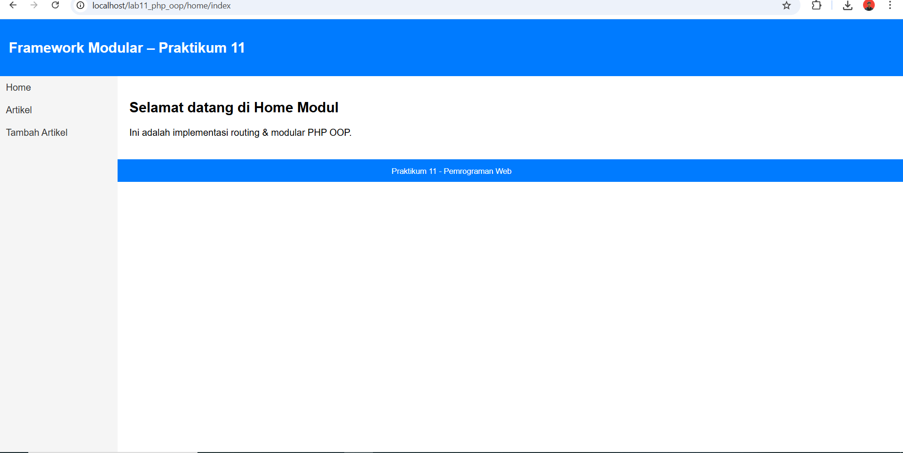
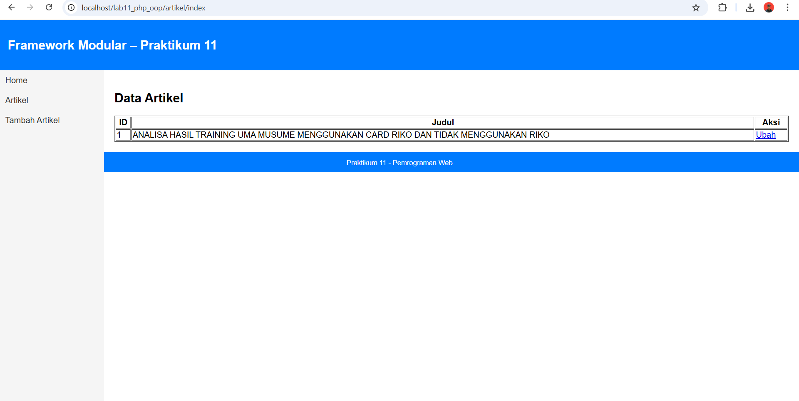
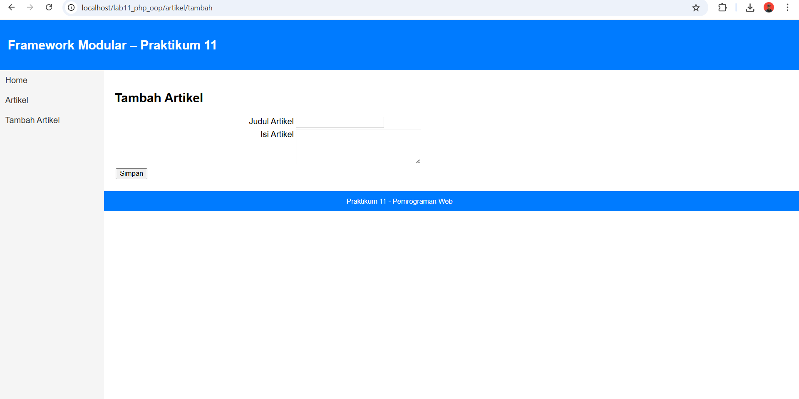

# Nama: Haikal Lukman Nur Hakim
# Nim: 312410142
# Mata Kuliah: Pemrograman Web
# Nama Project: lab11_php_oop
## Tujuan Praktikum:

Menerapkan modularisasi pada struktur aplikasi PHP

Menggunakan konsep routing sederhana

Menggabungkan class OOP (Database & Form) ke dalam framework mini

## Hasil Gambar





## 1. Struktur Folder Project

Project dibangun dengan pola modular agar setiap fitur berada di dalam folder masing-masing.
````
lab11_php_oop/
├── .htaccess
├── config.php
├── index.php
├── class/
│   ├── Database.php
│   └── Form.php
├── module/
│   ├── home/
│   │   └── index.php
│   └── artikel/
│       ├── index.php
│       ├── tambah.php
│       └── ubah.php
└── template/
    ├── header.php
    ├── sidebar.php
    └── footer.php
````

Penjelasan singkat:

class/
Berisi library utama seperti Database dan Form.

module/
Tempat setiap fitur disimpan.
Contoh: module artikel, module home, dll.

template/
Bagian layout yang digunakan seluruh halaman.

index.php
Gerbang utama sekaligus router.

.htaccess
Mengaktifkan URL rewriting agar routing bekerja.

## 2. Konfigurasi Database (config.php)
```php
<?php
$config = [
    'host' => 'localhost',
    'username' => 'root',
    'password' => '',
    'db_name' => 'latihan_oop'
];
?>
```

Pastikan database latihan_oop sudah dibuat di phpMyAdmin.

Tabel contoh:
```mysql
CREATE TABLE artikel (
    id INT AUTO_INCREMENT PRIMARY KEY,
    judul VARCHAR(255),
    isi TEXT
);
```

## 3. Routing Menggunakan index.php

Routing berjalan berdasarkan PATH_INFO yang diterima dari URL.

Contoh URL:
```
http://localhost/lab11_php_oop/artikel/tambah
```

Akan diarahkan otomatis ke:
```
module/artikel/tambah.php
```

Potongan kode routing:
```php
$path = isset($_SERVER['PATH_INFO']) ? $_SERVER['PATH_INFO'] : '/home/index';
$segments = explode('/', trim($path, '/'));

$mod  = $segments[0] ?? 'home';
$page = $segments[1] ?? 'index';

$file = "module/{$mod}/{$page}.php";
```
## 4. URL Rewriting (.htaccess)
File .htaccess berfungsi agar URL dapat dibaca router tanpa menggunakan ?page=.
```
<IfModule mod_rewrite.c>
    RewriteEngine On
    RewriteBase /lab11_php_oop/

    RewriteCond %{REQUEST_FILENAME} !-d
    RewriteCond %{REQUEST_FILENAME} !-f

    RewriteRule ^(.*)$ index.php/$1 [L]
</IfModule>
```

Pastikan nama file benar: .htaccess (bukan htacces atau lainnya).

## 5. Template Layout
```
Template terbagi menjadi tiga:

header.php

Membuat header & import style.

sidebar.php

Daftar menu:

Home
Artikel
Tambah Artikel

footer.php

Bagian kaki halaman.

Dengan pemisahan ini, halaman menjadi lebih rapi dan mudah dikembangkan.
```

## 6. Modul Home
```
module/home/index.php

Berisi konten halaman utama.
```

## 7. Modul Artikel
```
Terdiri dari:

artikel/index.php

Menampilkan list data artikel.

artikel/tambah.php

Form input artikel menggunakan Class Form.

artikel/ubah.php

Form update data berdasarkan ID.

Semua modul memanfaatkan class:

Database.php untuk query database

Form.php untuk membangun form otomatis
```

## 8. Kelas OOP yang Digunakan
```
Database.php

Meng-handle koneksi, insert, update, dan query.
```
Form.php

Membuat elemen input (text, select, radio, checkbox, password, textarea) secara dinamis.

Contoh pemanggilan:
```php
$form->addField("judul", "Judul Artikel");
$form->addField("isi", "Isi", "textarea");
$form->displayForm();
```

## 9. Kesimpulan Praktikum

Pada praktikum ini dipelajari bagaimana membangun mini framework PHP menggunakan:

OOP (class Database & Form)

struktur modular

teknik routing menggunakan PATH_INFO

URL rewriting melalui .htaccess

pemisahan layout dengan template

Konsep ini menjadi pondasi untuk memahami framework besar seperti CodeIgniter dan Laravel.
